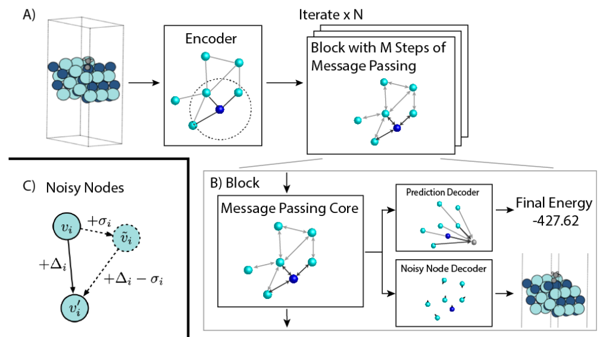

# NoisyNodes_Pytorch
Implementation of Very Deep Graph Neural Networks Via Noise Regularisation

A PyTorch implementation of "<a href="https://arxiv.org/abs/2106.07971">Very Deep Graph Neural Networks Via Noise Regularisation</a>" paper, worked as base model of KDD cup 2021 3rd place team Quantum (DeepMind).

## Model Description
</img>

## Hyperparameters for training NoisyNodes
Following Options can be passed to `exec.py`

`--M:`
Number of Message passing steps for each block. Default is 10.  
usage example :`--M 10`  

`--N:`
Number of Block iteration in Process step. Default is 2.  
usage example :`--N 2`  

`--noise_std:`
Standard deviation for Gaussian Noise corrupting the atomic position (coordinate). Default is 0.02.  
usage example :`--noise_std 0.02`

## Notice
Code is on progress. Please tell me any known details about the paper. 